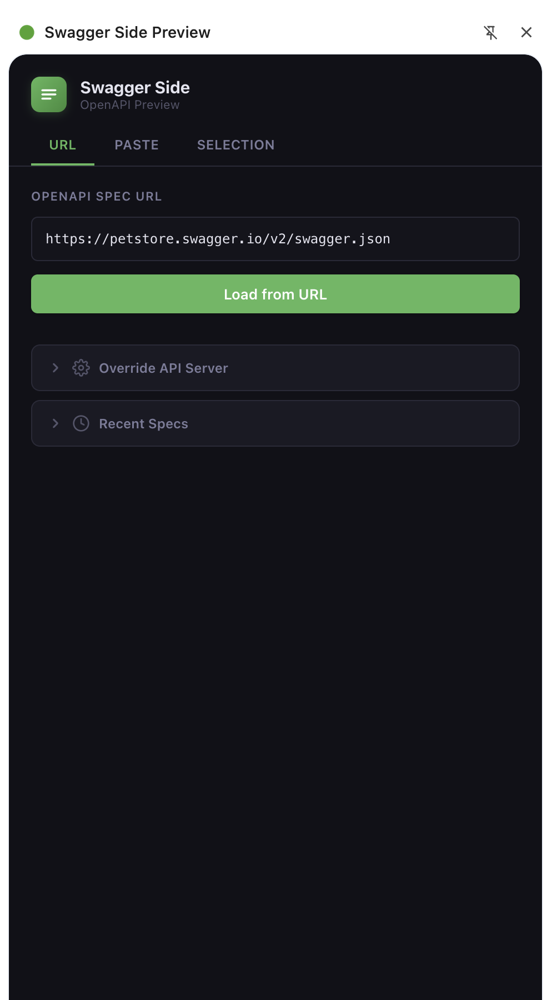
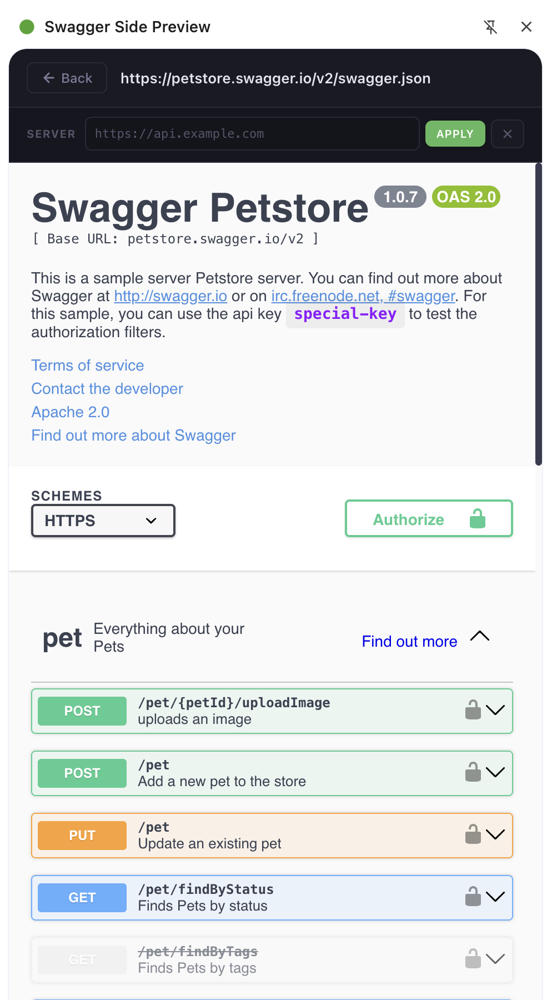

# Swagger Side Preview

A Chrome side panel extension to preview OpenAPI/Swagger docs in Swagger UI without leaving your current tab.

## Features

- **Side panel** : renders Swagger UI in Chrome's native side panel, so your browsing stays uninterrupted
- **Three ways to load a spec:**
  - **URL** : paste a link to any hosted OpenAPI JSON file
  - **Paste** : drop raw JSON directly into the editor
  - **Selection** : select JSON on any webpage, right-click, and import it
- **Live server override** : change the API host on the fly from the rendered view
- **Live request header override** : inject any custom header/value into Swagger requests
- **History** : recent specs are saved locally for quick access

## Screenshots

| Input Panel | Swagger UI Viewer |
|---|---|
|  |  |


## Installation

### From the Chrome Web Store

1. Visit the [Chrome Web Store listing](#) *(link TBD after publishing)*
2. Click **Add to Chrome**
3. Click the extension icon in the toolbar to open the side panel

### From source

```bash
git clone https://github.com/fccsec/swagger-preview-extension.git
cd swagger-preview-extension
```

1. Open Chrome and go to `chrome://extensions`
2. Enable **Developer mode** (top-right toggle)
3. Click **Load unpacked**
4. Select the cloned folder
5. Click the extension icon in the toolbar to open the side panel

## Usage

### Load from URL

1. Open the side panel
2. Stay on the **URL** tab
3. Paste a spec URL (e.g. `https://petstore.swagger.io/v2/swagger.json`)
4. Click **Load from URL**

### Paste a spec

1. Switch to the **Paste** tab
2. Paste your OpenAPI JSON
3. Click **Render Spec**

### Import from page selection

1. Select an OpenAPI JSON document on any webpage
2. Right-click the selection
3. Choose **Import to Swagger Side Preview**
4. The spec renders automatically in the side panel

### Override the API server

From the rendered Swagger UI view, use the **Server** bar at the top:

1. Type a base URL (e.g. `https://staging.api.example.com`)
2. Press **Enter** or click **Apply**
3. Click the **X** button to reset to the spec default

You can also set a default server override from the input panel under **Override API Server** before loading a spec.

### Override request headers

From the rendered Swagger UI view, use the **Header** bar at the top:

1. Enter a header name (e.g. `X-API-Key`)
2. Enter a value
3. Press **Enter** or click **Apply**
4. Click the **X** button to clear the override

You can also set a default header override from the input panel under **Override Request Header** before loading a spec.

## Contributions
If you have ideas to improve the extension don't hesitate do create a PR.
